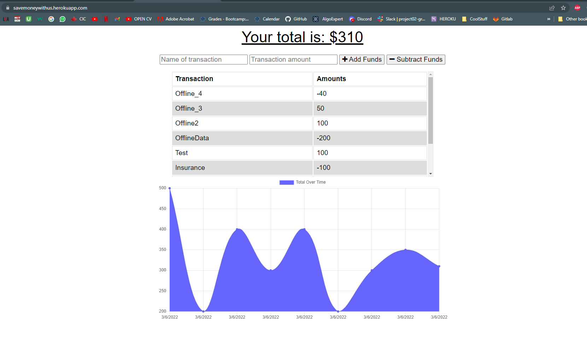

<h1 align='center'>Save Money By Tracking (Budget Tracker)</h1>
    
    <h2 id="description">Description</h2>
    
In this application, a user is able to track his withdrawals and deposits with or without a data/internet connection. With a working internet, the update will be real time, while being offline, the user's activities will be stored in IndexedDb so when the user goes back online, the transactions will be updated to the db and the website will reflect the changes.

    
The Live Link: <a href="https://savemoneywithus.herokuapp.com">https://savemoneywithus.herokuapp.com/</a>

    

    <h2>Table of Contents</h2>
    <ul>
        <li><a href="#description">Description</a></li>
        <li><a href="#install">Installation</a></li>
        <li><a href="#usage">Usage</a></li>
        <li><a href="#license">License</a></li>
        <li><a href="#contri">Contributing</a></li>
        <li><a href="#test">Tests</a></li>
        <li><a href="#question">Questions</a></li>
    </ul>
    

    <h2 id="install">Installation</h2>
    
mongoose express

    

    <h2 id="usage">Usage</h2>
    
UofT Bootcamp

    

    <h2 id="license">License</h2>
    
    
MIT

    

    <h2 id="contri">Contributing</h2>
    
Karan Sodhi

    

    <h2 id="test">Tests</h2>
    
Unit

    

    <h2 id="question">Questions</h2>
    
Incase of questions, Find me on: 

    
 :<a href='mailto: karanpreetsodhi1997@gmail.com'>Email</a>

    
 :<a href='https://github.com/kkkaran'>Github</a>

